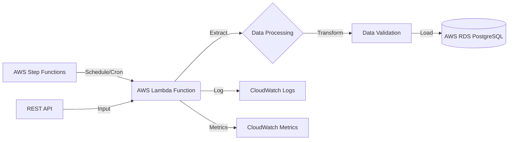

# data-aws-lambda-etl

This project sets up an AWS Lambda function for ETL (Extract, Transform, Load) operations using the DLT (Data Load Tool) framework.



## Architecture Overview

1. **AWS Step Functions**: Schedules the Lambda function execution.
2. **AWS Lambda Function**: Runs the ETL process.
3. **REST API**: Serves as the data source.
4. **AWS RDS PostgreSQL**: Stores the processed data.
5. **AWS CloudWatch**: Handles logging and metrics.

## Requirements
this repo is a serverless application that can be deployed with the Serverless Application Model (SAM) CLI. It also uses docker to build the lambda function image and push it to AWS ECR.

the python code is based on the dlt rest api source and the postgres destination and using rye to package the dependencies.

## Setup

You will need to standup and RDS postgres instance and a lambda function that has a VPC access to the RDS instance - these can be created manually or with aws cloudformation. for the POC and keeping it simple the RDS instance is in the same VPC as the lambda function but in a different subnet and security group also the lambda function needs to have a policy to access the secrets manager - the RDS VPC is in the template.yml file at the moment but could be to use a more dynamic approach.
1. **Create Secrets**:
   Create two secrets in AWS Secrets Manager:

   a. Database Credentials:
   ```bash
   aws secretsmanager create-secret \
       --name dev/janos \
       --description "Database credentials for DLT function" \
       --secret-string '{"username":"<your-username>","password":"<your-password>","host":"<your-host>","port":"<your-port>","database":"<your-database>"}'
   ```

   b. API Credentials:
   ```bash
   aws secretsmanager create-secret \
       --name DLT_ApiCredentials \
       --description "API credentials for DLT function" \
       --secret-string '{"api_base_url":"<your-api-url>","api_token":"<your-api-token>"}'
   ```

2. **Deploy the Stack**:
   Use AWS SAM to deploy the stack:
   ```bash
   sam build
   sam deploy
   ```

```bash
   sam deploy --stack-name=dlt-etl-poc --resolve-image-repos --resolve-s3 --capabilities CAPABILITY_IAM
```
You can check out cloudformation to get the outputs of this command and the endpoint to call the api etc.


1. **Generate requirements.txt**:
We have to generate a requirements.txt file because the lambda function is packaged as an image and the dependencies are not available in the image.
```bash
rye list --all > src/data_aws_lambda_etl/requirements.txt
```

## Lambda Function Configuration

The Lambda function is configured with:
- Timeout: 30 seconds
- Memory: 1024 MB
- VPC access for RDS connectivity
- Permissions to access Secrets Manager

## Environment Variables

The Lambda function uses the following environment variables:
- `DLT_PROJECT_DIR`: "/tmp"
- `DLT_DATA_DIR`: "/tmp"
- `DLT_PIPELINE_DIR`: "/tmp"
- `DATABASE_CREDENTIALS_SECRET_ARN`: ARN of the database credentials secret
- `API_CREDENTIALS_SECRET_ARN`: ARN of the API credentials secret


## Local Development

For local development, use the AWS Lambda Python 3.12 runtime:
```
public.ecr.aws/lambda/python:3.12
```

## References

- [DLT REST API Source](https://dlthub.com/docs/dlt-ecosystem/verified-sources/rest_api/basic)
- [DLT PostgreSQL Destination](https://dlthub.com/docs/dlt-ecosystem/destinations/postgres)
- [DLT AWS Taktile Blog - example of using dlt with lambda in production](https://dlthub.com/blog/dlt-aws-taktile-blog)
## Cleanup

To delete a secret:
```bash
aws secretsmanager delete-secret \
    --secret-id arn:aws:secretsmanager:<region>:<account-id>:secret:<secret-name> \
    --force-delete-without-recovery
```